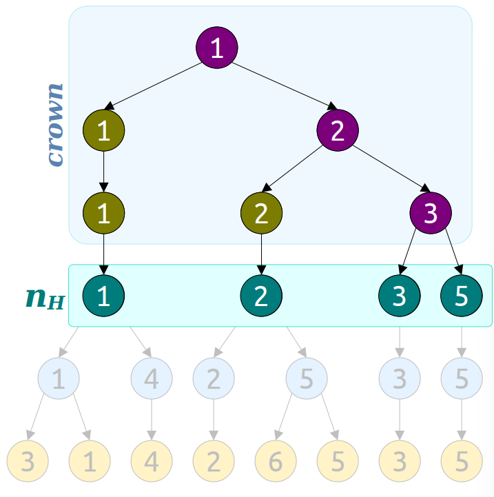

### Abdication Heaps

---

首先还是回顾以下tournament heap的基本情况：

首先一个tournament heap是一个tournament tree的集合，我们以size的升序存储这些trees. 

最基本的结构，以$2^x,x=0,1,2,\cdots$构建很多的完全二叉树，构建的过程就像是锦标赛晋级一样，两个元素顶出一个最小的元素，自底向上构建这个tree. 

lazy的版本大概是我们先构建$O(\log n)$个bucket，每个bucket表示对应高度的tree的bucket，将对应高度的tree放入对应的bucket，对应每个bucket来说如果bucket中元素超过2个，就合并并放入下一个高度的bucket中。

对于Eager Binomial Heap来说我们知道以下操作的时间复杂度为：

- enqueue: $O(\log n)$.
- meld: $O(\log n)$.
- find-min: $O(\log n)$.
- extract-min: $O(\log n)$.

对于Lazy Binomial Heap来说：

- enqueue: $O(1)$.
- meld: $O(1)$.
- find-min: $O(1)$. 
- extract-min: $O(\log n)$ (均摊时间复杂度)

考虑我们需要新的要求：decrease-key的操作

解释：给定一个指向队列中某个元素$v$的指针，我们需要将其key从$v$变为$k$，我们需要对于这个队列进行调整。

这个操作对于提高一些算法的实现效率是很有帮助的：Dijkstra algorithm, Prim MST algorithm.

考虑带优先队列的最短路算法：

- $O(n)$次的入队操作；
- $O(n)$次的extract-min操作；
- $O(m)$次decrease-keys操作；

总时间为：$O(nT_{enq}+nT_{ext}+mT_{dec})$.

对于最小生成树算法来说情况是类似的。

如果我们考虑使用标准的binary heap，对于最短路算法或者Prim最小生成树算法来说：
$$
\begin{split}
&O(nT_{enq}+nT_{ext}+mT_{dec})\\
=& O(n\log n + n\log n + m \log n)\\
=& O(m\log n)
\end{split}
$$
如果我们使用lazy tournament heap:
$$
\begin{split}
&O(nT_{enq}+nT_{ext}+mT_{dec})\\
=& O(n + n\log n + m \log n)\\
=& O(m\log n)
\end{split}
$$
我们想要是实现的abdication heap可以有这样的时间复杂度：

- enqueue: $O(1)$;
- extract-min: $O(\log n)$;
- decrease-key: $O(1)$;

使用abdication heap我们得到的总时间为：$O(m+n\log n)$.

仍然从tournament heap出发，我们考虑如果需要对元素的值进行修改的情况下如何进行处理。

一种很直接的思路是我们可以在每个元素入队的时候引出一个指向该元素的叶子结点的指针。当对元素进行修改的时候我们从叶子节点出发到root节点修改对应需要修改的值。

显然最坏的情况下的时间复杂度为$\Theta(\log n)$.

我们如何将其加速到$O(1)$的时间复杂度呢？

用空间换时间，我们考虑对于每个中间节点都存储一个指向其对应的叶子节点的指针。这样只要我们能修改到叶子节点的值对应的其他节点的值都会发生改变。

考虑更新完这些复制的值后，这个树可能出现的情况：

- 如果仍然是一个tournament tree，我们无需进行后续操作。
- 如果这个调整破坏了最小堆的性质，即当前的tree不是一个tournament tree，我们需要进行进一步的修正。当时这一步调整的操作最坏情况下需要$\Theta(\log n)$的时间。无法满足我们需要的在$O(1)$的时间内decrease-key操作。

我们的改进是，考虑如果当前的decrease-key的操作使得这个tree不再满足heap的条件，我们直接断开最高的copied的值和其parent之间的连接，这样这个tree不再满足满二叉树的性质，但是我们保证其仍然满足heap的性质。

考虑这种cutting的操作是否会对我们设计的之前的其他操作产生什么影响。

- enqueue：仍然是创建一个新的单点然后进行meld.
- extract-min: 过程仍然是首先找到最小元素所在的根节点，我们找到路径然后进行删除以及拆分，之后对新拆分得到trees考虑进行meld. 对于相同高度的trees进行聚合。

我们发现此时extract-min操作的均摊时间复杂度不再是$O(\log n)$. 

**Corollary**: There is no upper limit to the heights of the trees in our modified heap.

我们可以发现，对于extract-min时的聚合操作，如果tree的高度是没有限制的，则进行一个聚合操作时可能需要compact任意的一些tree. 这个过程最坏情况下时间为$\Theta(n)$. 

至此，我们回顾一下问题所在：如果我们不考虑decrease-key的问题我们可以保证每个tree都是完美二叉树，因此extract-min操作可以很快，然而考虑快速实现decrease-key操作时我们无法保证每个tree的shape，从而无法保证extract-min的效率。

如何在这两者之间进行trade-off?

考虑我们上上次讲的内容的策略：替罪羊树(Scapegoat Tree)

**Idea**: 选一个常数$\alpha > 1$同时强制要求对于每个在heap中的树的高度限制为$\alpha \log n$. 

这里的$n$表示为heap中所有元素的个数。

我们考虑如果在这个heap中出现了tree不满足这个高度限制，我们直接对该tree进行重构。

举个例子，假设我们在一次extract-min操作后得到的tree的高度超过了$\alpha \log n$. 我们需要对这个tree进行重构。

与替罪羊树一样的，我们可以找到最高的位置不满足$\alpha-$balanced，然后对于这个位置向下的子树，这里我们将高于这个高度的节点的集合称为crown.

直觉上来说我们知道这个crown中的节点包含了很多bad nodes，对于这部分bad nodes我们考虑直接删除所有在crown中的节点。

对于一个abdication heap来说，我们可以认为其是基于lazy tournament heap的改进版本：

- 首先我们选择了一个系数$\alpha > 1$来保证在heap中的所有的trees都满足高度不超过$\alpha \log n$. 
- 为了实现decrease-key同时保证trees的heap的性质，我们找到copied的最高的位置，如果出现其破坏了heap的性质，我们考虑在该位置将tree进行截断。
- 最后因为tree不再满足完美二叉树的性质，我们考虑之前的高度约束，一旦出现高度超出的情况我们直接删掉所有的crown节点。将一个tree拆分为多个不同的trees. 这一步可以保证extract-min的均摊时间复杂度。

我们分析一下crown集合，考虑下面的这个图：

我们先给出三个基本的定义：

$g$表示为在crown中的好节点，$b$表示在crown中的坏节点，$n_H$表示为在crown下一层的所有节点。

我们可以知道当我们删除一个crown的时候，我们需要的扫描的节点数量的上界为$g+b+n_H$. 

**Claim**: $n_H-1=g$.

我们定义在crown中的最后一层的节点的数量为$n_L$，对于每个bad node我们知道对于在下面的每一层其都贡献了一个节点，同时我们假设了最多存在$b$个坏节点。每个好的叶子节点对于下面的每一层贡献了两个节点，这也就说明$n_H > 2n_L -b$，也就是$b > 2n_L - n_H$. 

此时假设crown的高度为$h$，考虑不平衡的问题我们知道crown的下一层的高度不满足平衡性即：$h+1> \alpha \log n_H$. 而对于crown自身，其一定是平衡的即$h\leq \alpha \log n_L$, 结合一下我们知道：$\alpha \log n_L + 1 > \alpha \log n_H$. 即$n_L > n_H \cdot 2 ^{-1/\alpha}$. 

结合：
$$
\begin{split}
b >& 2 n_L - n_H\\
n_L >& n_H \cdot 2^{-1/\alpha}\\
\end{split}
$$
从而有：$n_H < b \cdot (2^{1-1/\alpha}-1)^{-1}$. 

进一步对于$g+b+n_H$我们可以得到约束：$b\cdot (1+2(2^{1-1/\alpha}-1)^{-1})$. 

也就是说考虑移除一个crown我们最多需要$O(b)$的时间。

直觉上来说：

- 如果我们有一个很大的crown，我们可以认为其中有很多bad nodes. 
- 而我们每次decrease-key只能得到一个bad node，假设我们认为每个decrease-key的时间为$O(1)$，我们认为可以承受删除一个crown的时间代价。

最坏情况分析：

- meld: $O(1)$;
- enqueue: $O(1)$;
- decrease-key: $O(1)$;
- extract-min: $O(n)$;

对于extract-min的均摊复杂度：$O(\log n)$.

对于势能函数的定义为：$\Phi = T+ 2z(\alpha)\cdot B$. 

$T$表示为heap中的所有tree的个数，$B$表示为在一个heap中bad nodes的个数。

对于extract-min操作，我们考虑如下的实现方式：

- 实施在lazy tournament heap的标准的删除方式；
- 在overtall的tree中删除所有的crowns;

第一步的时间为$O(t+\log n)$, $\Delta\Phi=-t+O(\log n)$. 

考虑一开始我们有$t$个trees，做完这一步后我们有$O(\log n)$个trees.

第二步的时间为$O(b)$. 刚刚已经分析过了，从而我们知道$\Delta\Phi=-b\cdot z(\alpha)$. 

对于每个tree的均摊复杂度为$O(1)$. 

从而合计一下势能的变化我们发现均摊时间复杂度为$O(\log n)$.

在实际使用中，这个heap的常数代价太高了，因为每个节点需要维护大量的信息，同时每个操作的常数因子是很大的。在理论上这个结果还是很好的，包括势能函数的使用，decrease-key的实现思路可以用于一些其他的优先队列中，我们可以得到最优的最短路和最小生成树的算法的时间。

一些其他的heaps:

- Fibonacci heap 常数时间的decrease-key
- pairing heap
- strict Fibonacci heap 
- quake heap

#### Next Time 

- String data structures
- Suffix Trees