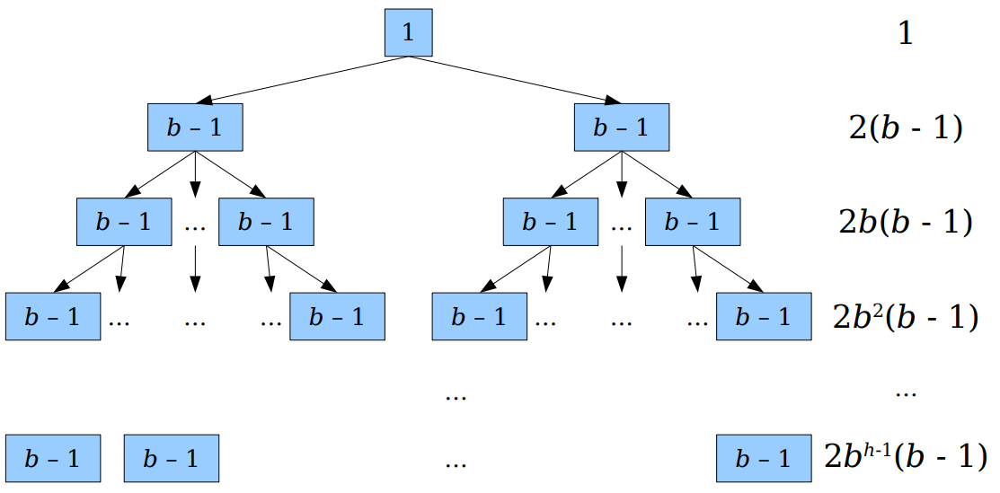
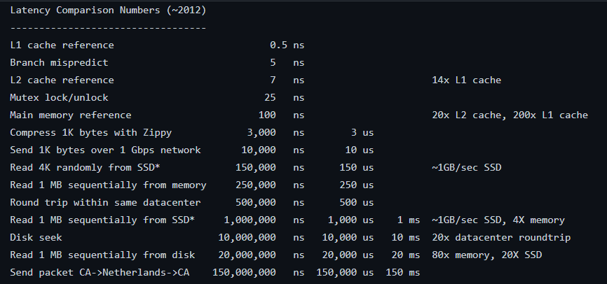
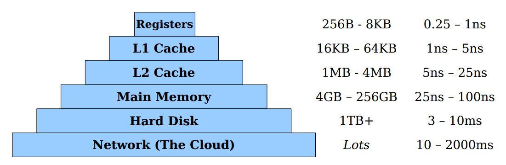

# Balanced Trees 

---

### Part One

BST review, Overview of Read/Black Tress, B-Trees, 2-3-4 Trees, Intuiting Red/Black Trees 

#### BST review 

Basic Action in Binary Search Trees 

- Search: 从根节点开始递归寻找节点，如果当前节点的值等于target返回，如果没有节点了返回-1，小了递归到左子树，大了递归到右子树。
- Insert: 从根节点开始递归，递归出口，当前输入的节点为空，则直接对需要插入的值创建新节点并返回；插入的值小于当前的节点的值，递归左子树，否则递归右子树。
- Delete: 首先调用Search找到节点所在的位置，分为几种情况：(1). 没有左右子树，直接删除；(2). 有左子树或者右子树，删除之后，用存在的那个子树替代被删除节点的位置；(3). 既有左子树，又有右子树，在右子树找到最小值，使用最小值替换被删除节点的位置。

Runtime Analysis: $O(h)$. 这里的$h$表示的是树的高度。

best case: $O(\log n)$, worst case: $O(n)$. 其中$n$表示为节点总数。

#### Red/Black Trees 

[Extra]: What is the difference between AVL and Red/Black Trees ?

首先两者都是平衡树，但是AVL的平衡要求更高一些 (path from the root to the deepest leaf in an AVL tree is at most $1.44\times\log(n)$), 而RBT的是$2\times \log(n)$. 

对于扫描查找操作来说：AVL Tree的速度更快，但是插入和删除的效率不如Red/Black Tree. 

宽泛的说，如果查找的次数较多考虑使用AVL Tree而插入删除较多考虑使用Red/Black Tree. 

更细致一些（内容来自于[stackoverflow](https://stackoverflow.com/questions/16257761/difference-between-red-black-trees-and-avl-trees)）：

**For small data: **

- Insert: RB tree和AVL tree都有常数数量的最大旋转次数，但是RB tree平均意义上的旋转次数更少，因此也更快。
- Lookup: AVL tree的深度更小，查找更快。
- Delete: RB tree有常数数量的旋转次数，但是AVL tree的最差情况下的旋转次数为$O(\log n)$. 

**For large data**:

- Insert: AVL tree更快，因为在插入之前需要查找一个特定的节点，同时考虑数据量较大的情况下，这个插入的时间瓶颈不在旋转，而在之前的查找的时间，而这个查找时间取决于深度，AVL的深度更小，因此可能会更快。（当然这个还是要看情况的）
- Lookup: AVL tree更快，同small data. 
- Delete: 平均意义下AVL tree可能更快，但是最坏情况下RB tree更好，原理与Insert类似。最坏的情况是因为AVL tree的旋转次数是$O(\log n)$而RB tree是一个常数。

Red/Black Tree: BST with following properties:

- Every node is either red or black. 
- The root is black.
- No red node has a red child.
- Every root-null path in the tree passes through the same number of black nodes. 

（看到这儿其实有点晕，为啥会想到红黑树这种数据结构，同时构造的起源又是啥呢？）

#### B-Trees

首先先看B-Trees，可以看成广义上的BSTs

考虑一般的BST，一个key可以将tree分为两个部分，两个sub-trees，左边是小于key的元素，右边全是大于key的元素。

推广一下，如果一个节点存储的是keys，那么一个节点就将这个key space分为了$k+1$个部分，每个部分对应了一个sub-tree.

考虑这种推广的BST，有一个很惊人的发现是构建这样的一个平衡的广义BST比构建一般的平衡的BST要更加容易一些。

考虑极端的情况，如果第一个节点存了所有的keys，那么直接就变成了一个有序的数组，这个tree只有单个节点，但是实际情况是，这个节点能够存储的keys有限，这时可以采取的操作有：

- Push new key down into its own node.
- Split big nodes in half, kicking the middle key up. 

第一种选择: 容易实现但是可能会导致tree不平衡。

第二种选择: 可以保证tree平衡但是实现没那么容易。

构建这种多路的平衡树的思路：先确定一个上界表示每个节点所能够存储的keys的数量，将keys添加到叶子中，当一个节点包含的keys达到上界则分裂。这种方式的优势在于首先tree总是平衡的，其次插入以及查找的时间都相当的不错。

在实际操作中我们应该如何构建这样的平衡树呢？

**B-tree of order b**:

- 除了root节点外，每个节点有$b-1$到$2b-1$个keys；(root可以有$1$到$2b-1$个keys)
- 每个节点要么是叶子，要么child的数量要比keys的数量多1；
- 所有的叶子节点的深度相同；

##### Analysis of B-trees

首先考虑一个B-tree的高度问题，假设order为$b$同时有$n$个keys.

直觉上来说，每一层的keys的数量是关于$b$呈指数上升的。

worst case:

**Theorem**: The maximum height of a B-tree of order $b$ containing $n$ keys is $O(\log_b n)$. 

简单计算一下这种最坏情况：
$$
\begin{split}
&1+2(b-1) + 2b(b-1)+\cdots2b^{h-1}(b-1)\\
=&1+2(b-1)(1+b+\cdots+b^{h-1})\\
=&1+2(b-1)\frac{b^h-1}{b-1}\\
=&1+2(b^h-1)=2b^h-1 = n
\end{split}
$$
从而求得$h=\log_b((n+1)/2)$. The height is $O(\log_b n)$.

**考虑B-tree的查找速度：**

- 如果使用线性查找：$O(b\log_b n)$.
- 如果在每个node使用二分：$O(\log b\log_b n)=O(\log n)$. (从信息论的角度来说，从一个有序的物品中找到某个东西的最少需要的比较次数就是$O(\log n)$.)

**考虑B-tree的插入速度：**

每次插入需要访问$O(\log_b n)$个节点，同时最坏情况下我们需要将每个node分裂一下：$O(b\log_b n)$.

改写一下：$O((b/\log b)\log n)$，如何取值使得$b/\log b$最小呢？答案是选择$b=\lfloor e\rfloor = 2$.

由此我们引出2-3-4 Trees

##### 2-3-4 Trees

2-3-4 Trees是B-tree of order 2:

- 每个节点有1-3个keys；
- 每个节点要么是一个叶子节点，要么每个节点的child的数量比keys的数量多1；
- 所有的叶子节点的层数相同；

回顾一下B-Trees，我们证明了这里的order如果选择2或者3从理论上来说是最优的，但是实际上，我们往往会选择比如1024或者4096这种值。为啥呢？

##### Memory Hierarchy

对于内存而言speed和size之间存在trade-off.

SRAM stuff寄存器的速度很快，但是很贵。（GHZ但是SRAM的单元不容易合并，提高size很困难也很贵。）

Hard disks很便宜但是很慢。

经典的图：或者说[latency.txt](https://gist.github.com/jboner/2841832)

假设我们现在有一个很大的数据无法直接放入内存中，数据在disk上，我们需要根据需要读入内存，我们从disk读取数据的时候不是一个byte一个byte读的，而是一个page一个page读的，我们的目标是尽可能地降低磁盘读写的次数，而非执行指令的数量。

考虑B-tree每个节点的b的设置，如果我们设置为一个disk的page，我们只需要关心disk pages的读写的数量（因为磁盘读写太慢了，这块的时间成为了瓶颈）

对于这种模型的B-tree，lookup和insert的时间复杂度都是$O(\log_b n)$. 

由于B-trees的order $b$较大，这对于磁盘上的存储是很有优势的：

- 磁盘块读写比cpu慢很多；
- 较大的$b$可以最大限度地减少查找过程中需要读取的块的数量；
- 在一个区块内扫描的额外工作被这些节省的费用抵消。

这种最广泛地被用在：

- 数据库（huge amount of data stored on disk）
- 文件系统（ext4, NTFS, ReFS）
- 内存数据结构（由于cache的影响）

理论上从操作次数的角度分析时间：

- lookup: $O(\log n)$; insertion: $O(b\log_b n)$.

实际上从blocks accessed的角度来看：

- lookup: $O(\log_b n)$; insertion: $O(\log_b n)$.

现在考虑红黑树的问题，如果我们考虑将红色节点和他们的parents合并起来，我们就会得到一个2-3-4 Tree. 

事实上红黑树是2-3-4 Tree的一种等值线(isometry). 

### Part Two 

回顾一下上一个lecture的内容：2-3-4 Trees 多路搜索树

- 每个节点有1/2/3个keys；
- 任何一个有$k$个keys的非叶子节点都一定有$k+1$个children；
- 所有的叶子节点都在同一层（深度相同）；

考虑在2-3-4 tree中添加一个元素，将其放入一个叶子节点，如果超出了空间就将叶子分裂并将中间的值放入上一层，其他值仍然作为叶子。

再看红黑树的定义：

- 每个节点要么是红色要么是黑色；
- root节点一定是黑色；
- 所有的红色节点不会有红色child；
- 每个条从root到叶子节点的路径一定会遇到相同数量的黑色节点；

如果我们将红黑树中的所有红色节点并到其上层祖先节点中，则红黑树变为一棵2-3-4 tree

Red/Black Tree和2-3-4 Tree之间是可以相互转换的。

**Theorem**: The maximum height of a red/black tree with $n$ nodes is $O(\log n)$.

简单的将2-3-4 Tree的节点进行分类：

- 2-node: one key with two children;
- 3-node: two keys with three children;
- 4-node: three keys with four children;

对比Red/Black tree 和 2-3-4 tree，我们来讨论其插入的规则；

**rule 1**: 当插入一个节点时，如果其父亲节点时黑色的，那么将这个节点涂为红色，同时挂在父亲节点下方，结束。

（Hint: 这相当于在2-3-4 tree中，插入一个节点到2-node或者3-node中。） 

Building Up Rules:

- 将红黑树的构建映射到2-3-4 tree的构建规则中；
- 考虑将一个节点插入一个node中需要$O(1)$的时间，而2-3-4 tree支持$O(\log n)$的插入，那么红黑树自然也会支持$O(\log n)$的插入时间。
- 删除节点是类似的。

来自Keith老师的建议：

- Do know how to do B-tree insertions and searches. (尤其记住如何分裂节点的)

- Do remember the rules for red/black trees and B-trees. (2-3-4 trees的三条属性，red/black trees的四条属性)

- Do remeber the isometry between red/black trees and 2-3-4 trees. 

- Don't memorize the red/black rotations and color flips. 

  This is rarely useful. If you are coding up a red/black tree, just flip open CLRS and translate the pseudocode. 

  [Introduction to Algorithms](http://staff.ustc.edu.cn/~csli/graduate/algorithms/book6/toc.htm)

  [Solutions to CLRS](https://sites.math.rutgers.edu/~ajl213/CLRS/CLRS.html)

考虑一种动态的场景：Given an input X that can change in fix ways, maintain X while being able to compute $f(X)$ efficiently at any point in time. 

**[Example]**: Given a list of distinct values and a number $k$, return the $k$-th-smallest value.

在静态的情况下，即data set是固定的，k是已知的，我们可以在$O(n)$的时间内使用quickselect或者median-of-medians算法求解。

如果变成动态的情况下：即data set是在不断变化的，这种情况下我们可以使用一种红黑树的变种来维护。

**Order Statistic Trees** 

- 首先是一棵红黑树；
- 对每个节点标记，标记的值为其左子树的节点的个数；
- 使用之前的更新规则（插入删除元素时旋转）来保存值；
- 一直更改这棵tree直到到root节点。

分析效果：

- 在一次插入或者删除中只有$O(\log n)$的元素需要被更新同时每个更新的时间为$O(1)$. 
- 在$O(\log n)$的时间内支持BST的所有操作同时还有寻找第k大的顺序统计量以及rank (给定一个元素报告其顺序统计的位置).

扩展部分：1D Hierarchical Clustering 略

Next Time:

- Randomized Data Structures
- Families of Hash Functions 
- Count-Min Sketches

---

#### Personal Understanding 

看完这一部分的Slides，感觉没有完全搞懂，还是再进一步加深一下理解：

有一个理解：2-3-4 tree是自底向上构建起来的，不断向上顶出节点的过程；RB tree是自顶向下构建的过程，从上向下找添加节点的位置，然后通过旋转更新tree使得tree满足四条性质。

假设我们有一个array: `[3,1,5,4,2,9,10]`.

我们如何构建一个2-3-4 tree:

1. 我们显然可以接纳3,1,5三个值，创建一个3-node，存储了：`1,3,5`

2. 新值4进来后，发现这个3-node已经满了，因此将这个node进行分裂，从mid位置，重新创建一个节点，左子树存放`1`, 右子树存放`4,5`. 
3. 新值2进来后，直接添加到root节点的左子树中，左子树`[1,2]`, root`[3]`, 右子树`[4,5]`.
4. 新值9进来后，直接添加到右子树：左子树`[1,2]`, root`[3]`, 右子树`[4,5,9]`.
5. 最后一个新值10进来后，添加到右子树，发现已满，分裂右子树，创建新节点`[5]`，将`[5]`合并到其parent中，同时`[4]`和`[9,10]`接到新的root节点下：tree: root`[3,5]`, 子树1`[1,2]`, 子树2`[4]`, 子树3`[9,10]`. 

下面考虑如何在2-3-4 Tree中删除节点

1. 如果待删除元素在一个叶子节点。
   - 如果该节点是3-node或者4-node，那么我们直接将这个元素从node中删除；
   - 如果该节点是一个2-node，**underflow**的情况，存在以下三种情况：
     - 如果这个2-node包含了3-node或者4-node的兄弟节点，我们先将2-node转为3-node，转换的方式是从兄弟节点中“偷取”一个key，这一步可以通过左旋或者右旋实现：如果左兄弟是一个3/4-node，我们进行左旋，其他情况下进行右旋（方法类似），这样我们就可以将之前的包含待删除元素的节点2-node转换为3-node，回归上一个case我们直接删除待删除元素；
     - 如果所有的兄弟节点都是2-node同时parents node是一个3/4-node的情况，通过merge或者fusion的操作将2-node转换为4-node：(1). The current 2-node containing $x$ (delete element); (2). The left or right兄弟节点也是2-node; (3). parent node对应这两个节点；fusion之后我们发现parent node中的keys少了一个，同时fusion之后我们发现回到了之前直接删除的case.
     - 如果兄弟节点和parent节点都是2-node：这种情况只会发生在parent node是根节点的情况，同样采用fusion的形式，我们将兄弟节点，祖先节点以及待删除节点合并为一个4-node，然后直接删除变为3-node.
2. 如果待删除元素是一个中间节点。
   - 首先找到包含待删除元素的节点的predecessor（先驱）节点；这个先驱节点一定是一个叶子节点（左子树）
   - 将包含待删除元素节点与先驱节点进行交换，这样待删除元素的节点就是一个叶子节点；
   - 问题回到大的case. 1； 

时间复杂度和空间复杂度：

空间上：最好最坏都是$O(n)$.

时间上：所有的操作（查找，插入，删除）最好最坏都是$O(\log n)$.

