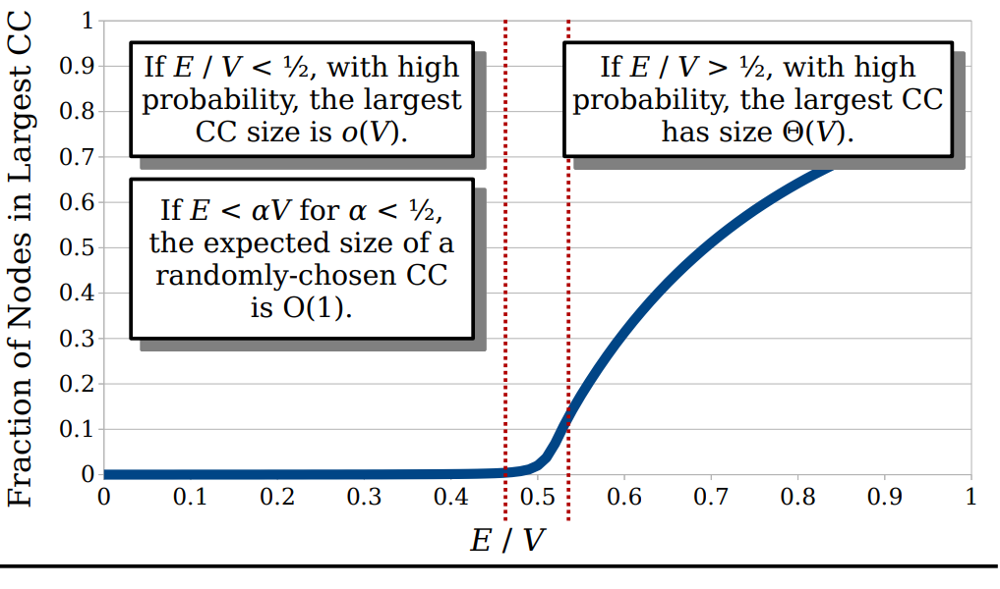
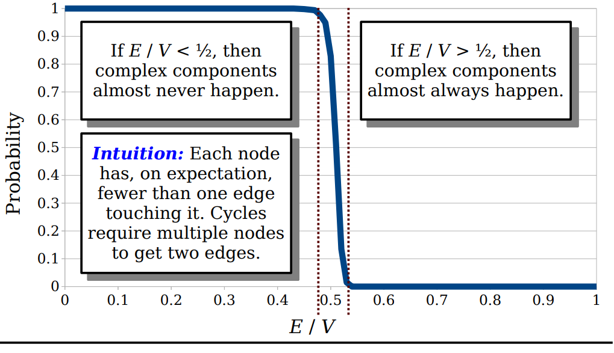

### Cuckoo Hashing 

---

#### Cuckoo Hashing 

A simple, fast hashing system with worst-case efficient lookups. 

处理hash冲突的常见方法：

- Closed Addressing: 将所有的冲突存储于一个辅助数据结构，例如链表或者BST (standard chained hashing).
- Open Addressing: 允许所有的元素超出bucket (linear probing hashing).
- Perfect Hashing: 使用多个hash函数来减少冲突。

下面引入Cuckoo Hashing

- 假设有一个hash表其中有$m$个位置。
- 与常见的hash表不同，我们使用两个hash函数：$h_1$和$h_2$. 
- 每个hash函数返回一个slot number $\{0,1,2,\cdots,m-1\}$.
- 我们假设这些hash函数都是真随机的同时做一个约束条件: $\forall x,h_1(x)\neq h_2(x)$.

那么显然，每个item $x$要么是在$h_1(x)$位置或者$h_2(x)$位置。

查找的时间最差为$O(1)$.因为只有两个位置需要check.

删除的时间最差为$O(1)$. 因为也是两个位置需要check. 

对于插入操作：先考虑是否可以插入$h_1(x)$, 如果当前的位置无法放入，将之前在该位置的元素$y$拿出来放入另一个位置$h_1(y)$或者$h_2(y)$. 重复进行这个操作直到稳定下来。

显然这里是可能存在问题的，因为可以能会有无限的循环（构成了一个cycle）

如果发生了这种情况，使用一个rehash来选择一个新的$h_1$和$h_2$同时将所有元素重新插入。

我们可以一直重复这个操作直到所有元素都能够找到位置。

下面我们考虑分析一下这种做法的性能：

假设我们需要将$n$个elements存储到一个有$m$个slots的hash表中，其中$n<\frac{1}{2}m$, 在所有的插入中一共会发生多少次位移呢？

load factor: $\alpha=\frac{n}{m}$. 

**theorem**: 基于假设$n=\alpha m$同时$\alpha < \frac{1}{2}$的前提下，插入操作的期望时间为$O(1)$.

这个问题的困难点在于：我们需要考虑多个hash函数之间的冲突问题；另外我们还需要推理替换的链路，哪些slot之间产生了替换关系。

**解决方案**：

**Cuckoo Graph**: 

The cuckoo graph is a multi-graph derived from a cuckoo hash table. 

这个图大概是这样建的: $G=(V,E)$:

- 所有的slots构成了所有的节点.
- 所有的elements/items构成了所有的边，每一条边：$(h_1(x),h_2(x))$. 
- 除此之外，我们额外增加一个dot的概念，每个dot表示每个item最终放置在的slot.

这样来看我们会发现，每一次的替换就是将这个edge换个方向。很巧妙的转换

**Claim 1**: 如果$x$被添加到一个cuckoo hash table中，如果当前包含$x$的联通分量不包含圈或者只包含一个圈，则这个插入可以成功。

**Claim 2**: 如果包含当前元素$x$的联通分量中包含了超过一个圈，那么这个插入操作就会失败。

下面逐步给出证明：

- A connected component of a graph is called **complex** if it contains two or more cycles. 
- **Theorem**: Insertion into a cuckoo hash table succeeds if and only if the resulting cuckoo graph has no complex connected components.

回到分析这个hash效率的问题上，我们考虑成功插入效率的问题就转换为问在这个图中联通分量会有多大的问题？而考虑我们期望上需要花多少时间进行rehash的问题也就转换为了有多大的概率这个图上出现联通分量是complex的。

#### Erdos-Renyi Model 

可以看到这里存在一个非常明显的分界线，大概是考虑边数与节点数的比值小于$\frac{1}{2}$时，最大的联通分量中的节点数量较少，一旦超过$\frac{1}{2}$，这个数量就会突增。

**Sizing a connected component **

**Target:** Show that if $E<\alpha V$ for some $\alpha < \frac{1}{2}$, then the expected size of a CC in a randomly-built graph is $O(1)$. 

我们可以使用最直接的方式，用BFS记录当前的联通分支共有多少个节点。

- 在我们的BFS中随机选择一个起点；
- 每一条在$E$中的边有$\frac{2}{V}$的概率能够连接到这个起点；
- 与起点邻接的节点的数量服从分布$B\sim(E,\frac{2}{V})$. 

我们考虑一些具体的分析：假设定义$X_k$表示为$k-$hops的节点的数量，从$X_0$开始$X_0=1$, $X_k=\sum_{i=1}^{X_k}\xi_{i,k}$. 其中$\xi_{i,k}$是服从$B\sim(E,\frac{2}{V})$的独立的随机变量。

这样我们从期望上计算，对于每个节点来说，其会拥有$\frac{2E}{V}$个孩子节点。对于这个tree来说，期望的分支因子为$\frac{2E}{V}$, 这个值根据前面的假设($E<\alpha V$)是小于1的. 

**Lemma**: $E[X_k]= (\frac{2E}{V})^k$. 

证明过程如下：
$$
\begin{split}
E[X_{k+1}] &= E[\sum_{i=1}^{X_k}\xi_{i,k}]\\
&=\sum_{j=0}^{\infty} E[\sum_{i=1}^{X_k}\xi_{i,k}\mid X_k=j]\cdot P\{X_k=j\}\\
&=\sum_{j=0}^{\infty} E[\sum_{i=1}^{j}\xi_{i,k}\mid X_k=j]\cdot P\{X_k=j\}\\
&=\sum_{j=0}^{\infty}\left( \sum_{i=1}^{j}E[\xi_{i,k}\mid X_k=j]\right)\cdot P\{X_k=j\}\\
&=\sum_{j=0}^{\infty}\left( \sum_{i=1}^{j}E[\xi_{i,k}]\right)\cdot P\{X_k=j\}\\
&=\sum_{j=0}^{\infty}\left( \sum_{i=1}^{j}\frac{2E}{V}\right)\cdot P\{X_k=j\}\\
&=\frac{2E}{V}\cdot \sum_{j=0}^{\infty}(j\cdot P\{X_k=j\})\\
&= \frac{2E}{V} E[X_k]\\

\end{split}
$$
合计所有levels，我们可以得到期望上来说，这个BFS tree上大概有$(1-\frac{2E}{V})^{-1}$个节点。

由于我们假设了$E=\alpha V$ for a fixed constant $\alpha < \frac{1}{2}$, this is $O(1)$ node per CC.

由于每个CC的期望节点的大小为$O(1)$, 从而对于插入操作来说，期望时间复杂度为$O(1)$. 

下面考虑第二个问题：们期望上需要花多少时间进行rehash的问题也就转换为了有多大的概率这个图上出现联通分量是complex的。

下图展示这样的概率，很神奇啊：

同样是以$\frac{1}{2}$为分界点，如果$E/V$的值小于$\frac{1}{2}$，出现complex component的概率几乎为0，而一旦超过了$\frac{1}{2}$，则这个概率就会突增。

**Theorem**: Let $E=\alpha V$ for some $\alpha <\frac{1}{2}$, the probability that any connected component is complex is $O(\frac{1}{V})$. 

从而我们导出了当使用cuckoo hash的情况下，满足$n=\alpha m$，一个序列长度为$n$的插入失败的概率为$O(\frac{1}{n})$，在其成功插入之前rehash的期望时间为$O(1)$. 

至此我们给出了一种新的hash的模型：cuckoo hashing

- Lookup: $O(1)$.
- Insert: expected $O(1)$. 
- Delete: $O(1)$.

#### Variants on Cuckoo Hashing 

考虑空间上的优化，因为我们考虑使用$m$个slots且$m >=2n$的，也就是说如果全部成功插入至少有一半的空间是用不上的。根本原因是随机图的一个基本属性；超过这个阈值$\frac{1}{2}$就几乎可以确定失败。

cuckoo hashing基于了两个强假设：

- 每个slot只能放一个item;
- 每个item只能放在两个positions. 

#### Summary

- Cuckoo hashing是一种非常快速且有效的构建完美hash table的方式。
- 我们可以通过提高hash函数的数量来提高load factor从而降低空间复杂度，虽然会增加查找和插入的时间。
- 我们可以提高每个slot能够放item的数量来提高load factor来降低空间复杂度，虽然也会增加一定的查找和插入的时间。

下一次的内容：

- Amortized Analysis 
- Potential Functions