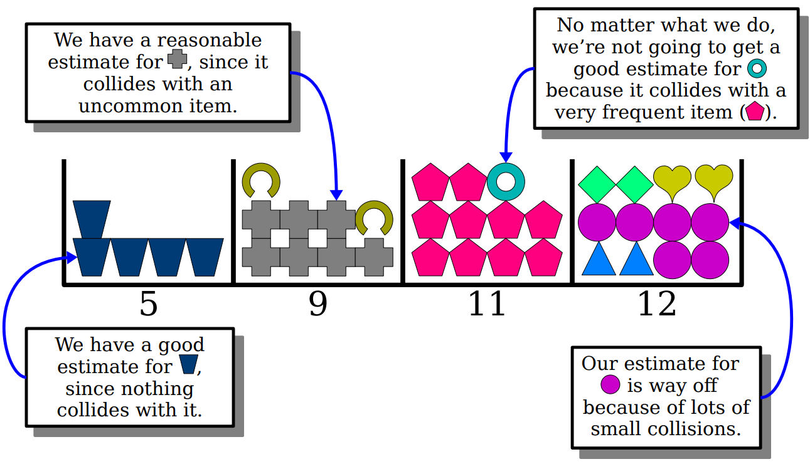
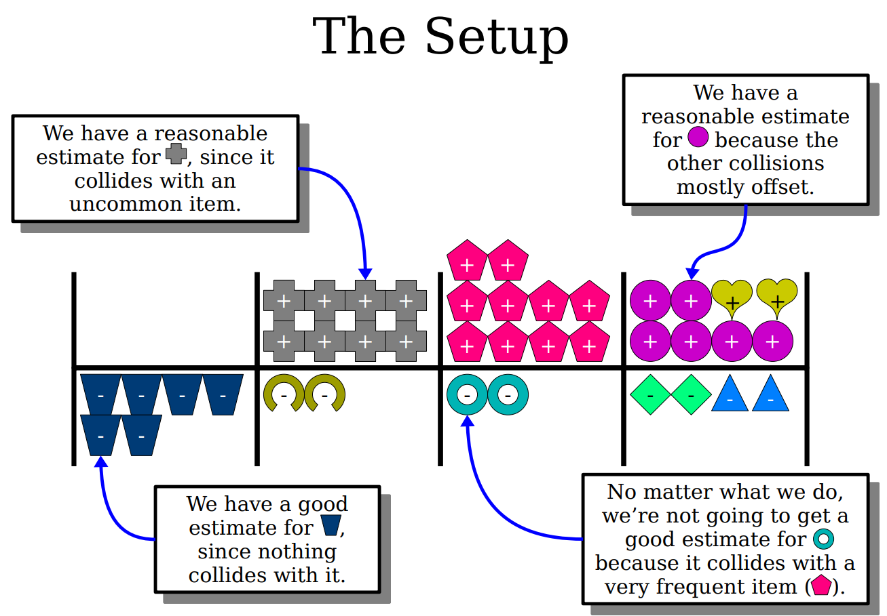
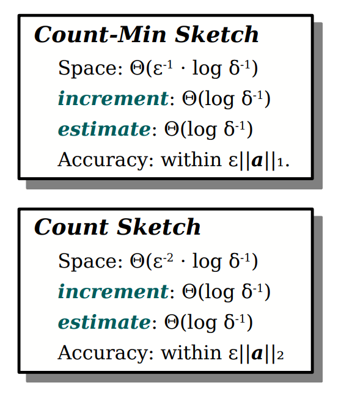
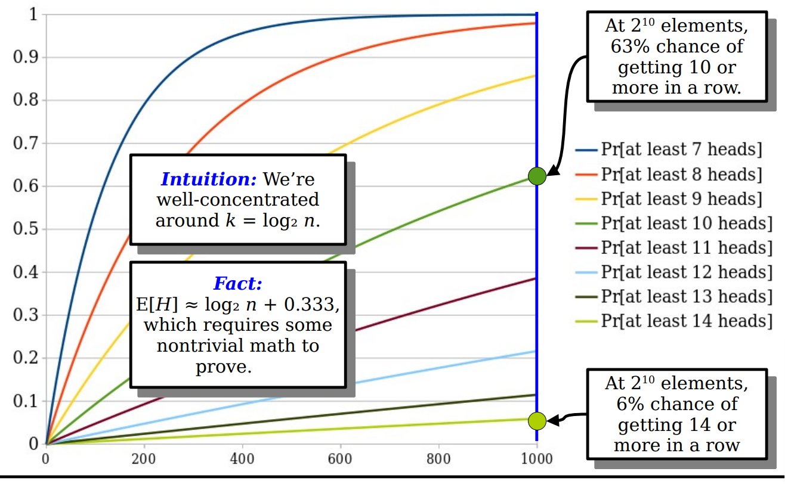

### Hashing And Sketching

---

#### Part One

- Hashing Functions

- Frequency Estimation

- Concentration Inequalities

- Probability Amplification 

##### Hashing in Theory-land 

**In theory-land, a hash function is a function from some domain called the universe (typically denoted $\mu$) to some co-domain.**

The co-domain is usually a set of the form $[m]=\{0,1,2\cdots,m-1\}$. $h:\mu\to [m]$.

首先考虑一件事情：不管你多聪明，你设计出来的hash函数也不会是完全随机的，因此大概会存在一些病态的输入会产生冲突；所以与其找一个完全正确的hash函数，我们假设我们有一堆hash函数来选取，我们可以随机选择用哪一个。

Families of Hash functions $\mathcal{H}$. 

这个hash函数集合就是我们用于随机抽样的hash函数的集合，那么考虑什么样的hash函数的集合才是一个好的集合？

If we pick $h\in \mathcal{H}$ uniformly at random, then $h$ should distribute elements uniformly randomly. 

**[Problem]** A hash function distributes $n$ elements uniformly at random over $[m]$ requires $\Omega(n\log m)$ space in the worse case. 

两条重要的性质：

**[Distribution Property]** Each element should have an equal probability of being placed in each slot. 

**[Independence Property]** Where one element is placed shouldn't impact where a second goes. 

如果一个hash函数集合满足这样的性质我们称其满足**2-independent**.

直觉上来说，2-independence意味着任意一对元素都不太可能冲突。

考虑一个hash函数 $h$:
$$
\begin{split}
&P\{h(x)=h(y)\}\\
=&\sum_{i=0}^{m-1}P\{h(x)=i \and h(y) = i\}\\
=&\sum_{i=0}^{m-1}P\{h(x)=i\}\cdot P\{h(y)=i\}\\
=&\sum_{i=0}^{m-1}\frac{1}{m^2}=\frac{1}{m}
\end{split}
$$

##### Approximating Quantities 

什么样的近似解会是一个好的解呢？

假设$\bold{A}$是真实值，同时$\hat{\bold{A}}$是一个我们预测的随机变量。

**[Observation 1]** 显然说如果期望相同就表示预测的好是不对的。

**[Observation 2]** $\mid \hat{\bold{A}}-\bold{A} \mid$理论上应该很小。

**[Observation 3]** 不是说一定是无偏的估值才是好的结果。

**[Observation 4]** 一个好的近似应该是可以调整的。

考虑两个参数：$\epsilon \in (0,1],\delta\in (0,1]$. 

$\epsilon$表示为准确度，$\delta$表示为置信度。

那么我们这样来评估一个$\hat{\bold{A}}$: Making and estimator $\hat{\bold{A}}$ for some quantity $\bold{A}$ where with prob at least $1-\delta$, $\mid \hat{\bold{A}}-\bold{A} \mid\leq \epsilon \cdot size(input)$. 

##### Frequency Estimation 

频率预测器是一个满足以下两种操作的数据结构：

- Increment(x): increments the number of times that $x$ has been seen;
- Estimate(x): returns an estimate of the frequency of $x$. 

使用二叉搜索树我们可以在space $\Theta(n)$ worst case time $O(\log n)$实现。

使用hash表我们可以在space $\Theta(n)$ expected $O(1)$的时间内实现。

频率预测器有这样的一些应用：

- Search engines: Finding frequent search queries. 
- Network routing: Finding common source and destination addresses. 

在这些应用中，$\Theta(n)$的空间占用可能会有些不切实际，我们的目标是希望在sub-linear的空间内得到一个关于这些queries的近似解。

##### The Count-Min Sketch 

考虑一般情况下我们构建一个频率预测器，我们使用一个Counter，对于每个独一无二的元素进行计数。

现在我们不这么做了，我们构建一个固定大小的计数器，可能会有不同的元素落到同一个格子中。

**Initial Structure** 

- assigning each $x_i$ to a counter by hashing function. 

- pick a number of counters $w$.
- from a family of 2-independent hash functions $\mathcal{H}$, a uniformly-random hash function $h:\mu\to[m]$. 
- create an array `count` of $w$ counters each initially zero. 
- To increment(x): `count[h(x)]+=1`.
- To estimate(x): `return count[h(x)]`.

考虑分析这种结构的效果，尤其是分析其中可能存在的冲突。

- $x_1,\cdots,x_w$表示为被存储在array中的不一样的items. 
- $a_1,a_2,\cdots$表示为这些item的frequency.
- $\hat{a}_1,\hat{a}_2,\cdots$表示为我们的数据结构预测的frequency.

观察任意一个$\hat{a}_i=count[h(x_i)]$:

- if $h(x_i) = h(x_j)$那么$x_j$对于$count[h(x_i)]$贡献了$a_j$.
- if $h(x_i) \neq h(x_j)$那么$x_j$对于$count[h(x_i)]$贡献了0.

我们定义一族随机变量：$X_1,X_2,\cdots$ as follows:
$$
X_j = \begin{cases} 1 & h(x_i)=h(x_j)\\ 0 &\text{otherwise}\end{cases}
$$
那么对于任意的一个$\hat{a}_i-a_i$我们可以表示为：$\hat{a}_i-a_i=\sum_{j\neq i}a_jX_j$. 

进一步得到：$E[\hat{a}_i-a_i] = E[\sum_{j\neq i}a_jX_j]$
$$
\begin{split}
E[\hat{a}_i-a_i] &= E[\sum_{j\neq i} a_jX_j]\\
&= \sum_{j\neq i}E[a_jX_j] = \sum_{j\neq i}a_jE[X_j]\\
&= \sum_{j\neq i}E[a_jX_j] = \sum_{j\neq i}a_jP\{h(x_i) =h(x_j)\}\\
&= \sum_{j\neq i}\frac{a_j}{w}\leq \frac{\mid\mid a\mid\mid_1}{w}
\end{split}
$$
**Markov's inequality**: If $X$ is a nonnegative random variable, then: 
$$
P\{X\geq c\}\leq \frac{E(X)}{c}
$$
从而$P\{\hat{a}_i-a_i > \epsilon \| a \|_1\}$可以写为：
$$
P\{\hat{a}_i-a_i > \epsilon \| a \|_1\} \leq \frac{E[\hat{a}_i-a_i]}{\epsilon \|a\|_1} \leq \frac{\|a\|_1}{w} \cdot \frac{1}{\epsilon \|a\|_1}=\frac{1}{\epsilon w}
$$
而从定义我们还知道：
$$
P\{\hat{a}_i-a_i > \epsilon \| a \|_1\} \leq \frac{E[\hat{a}_i-a_i]}{\epsilon \|a\|_1} \leq \delta
$$
所以一种很直观的想法大概是我们选取：$w = \frac{1}{\epsilon \delta}$. 

这样的选择导出的结果够好吗？

假设我们需要统计1000个不同的items，如果我们希望estimation to be within $\epsilon \|a\|_1$的真实结果by $99.9\%$的置信度。我们需要的内存大小为：$1000\cdot \epsilon^{-1}$, 这个结果似乎还不如我们直接统计来的好了。

我们可以选择一个确定的$w=k\cdot \epsilon^{-1}$. 那样我们失败的概率最高为$k^{-1}$. 这里我们可以考虑的值是$e$. 

同时我们搞点骚操作，我们对于这种结果，并行着跑$d$个：

当我们每次问询的时候，我们会得到$d$个结果，我们应该在这$d$个结果中如何选择呢？

最好的当然是选择最小的那个值，因为这个值产生了冲突的概率是最小的。

从理论上来分析一下：（注意这里的j表示为第j次的结果）
$$
P\{\min\{\hat{a}_{ij}\}-a_i> \epsilon \|a\|_1\}
$$
考虑什么情况下最小的预测结果是错的呢？那就是所有的结果都不对的情况：
$$
\begin{split}
&P\{\min\{\hat{a}_{ij}\}-a_i> \epsilon \|a\|_1\}\\
=&P\{\and_{j=1}^d (\hat{a}_{ij}-a_i>\epsilon \|a\|_1)\}\\
=&\prod_{j=1}^d P\{\hat{a}_{ij}-a_i> \epsilon \|a\|_1\}\\
\leq & \prod_{j=1}^d e^{-1} = e^{-d}
\end{split}
$$
总体来看：

- Update and query time are: $\Theta(d)$, which is $\Theta(\log \delta^{-1})$.

- Space usage: $\Theta(\epsilon^{-1}\cdot \log \delta^{-1})$.

  Each individual estimator has $\Theta(\epsilon^{-1})$ counters, and we run $\Theta(\log \delta^{-1})$ times of copy in parallel.

牺牲了完全的正确性，但是大大缩小了需要使用的内存/磁盘空间。

---

#### Part Two 

**Main result**： Count Sketches / Cardinality Estimation 

回顾一下上一个part的一些基本的性质：

- 对于一个hash函数族如果其满足分布性质（每个元素被放入每一个slot的概率相同）和独立性质（一个元素放在哪里不应该影响第二个元素）则我们称其为2-independent.
- 假设存在两个可调整的元素值$\epsilon$和$\delta$，分别代表准确度和置信度。我们在设计一个预测器$\hat{A}$的时候希望满足的条件是：在至少$1-\delta$的概率内满足$\mid \hat{A}-A\mid\leq \epsilon \cdot size(input)$. 

上一个part给出一个Count-Min Sketch 

1. 构建一个简单的预测器：hash items to counter and add +1 when item seen. 
2. 对于预测器计算期望的值：sum of indicators, 2-independent hashes have low collision rate. 
3. 应用Concentration不等式：one-sided error, use expected value and Markov's inequality.
4. 重复多次取最小：Take min, only fails if all estimates are bad. 

这一个part我们给出一个新的Count Sketch 

首先回顾到Count-min Sketches，我们会发现存在上图的一些情况，没有冲突/冲突的很少/冲突很多等等情况。

第一个问题：我们能否消除很多出现不太频繁的元素的冲突带来的影响呢？

首先第一步仍然是构建一个counters的array然后对于每个item分配一个counter. 

关键的一步是对于每一个item，assign x either +1 or -1.

这张图给出了大概的做法，下面我们给出具体是怎么实施的：

- 保持长度为$w$的counters的array
- 从hash函数族中随机选出一个$h\in \mathcal{H}$从$\mu$映射到$w$. 
- 再选出一个$s$将$\mu$映射到$\{-1,+1\}$.
- increment(x): `count[h(x)]+=s(x)`.
- estimate(x): `return s(x)*count[h(x)]`.

直觉上的理解：$h(x)$是考虑将item映射到哪个篮子里面，而$s(x)$考虑映射item为+1还是-1, 这种做法的好处是映射到同一个篮子中的items往往$s(x)$不会完全相同，大概率是一半一半的情况。从期望上来说这个得到的结果应该是无偏的估计结果。

定义$\hat{a}_i$表示我们对于真实的$a_i$的估计，对于每个其他的$x_j$如果产生$x_i$产生冲突的话，那么$\hat{a}_i$包含的可能的误差的结果：$s(x_i)\cdot s(x_j)\cdot a_j$. 

考虑我们计算$a_i$的真实结果：$s(x_i)a_i$，而如果$j$与$i$发生了冲突导致的结果大概是$a_i$多计数了$s(x_j)a_j$. 考虑所有的元素，我们计算这个误差情况：
$$
\hat{a}_i = \sum_{j} a_js(x_i)s(x_j)X_j
$$
其中这里的$X_j$是示性函数，表示是否发生了冲突。而$a_j s(x_i)s(x_j)$则表示的是冲突对于预测带来的影响。

我们计算一下期望：
$$
\begin{split}
E[\hat{a}_i] &= E[a_i+\sum_{j\neq i} a_js(x_i)s(x_j)X_j]\\
&=E[a_i] + \sum_{j\neq i}E[a_js(x_i)s(x_j)X_j]\\
&= a_i + \sum_{j\neq i} E[s(x_i)s(x_j)]E[a_jX_j]\\
&= a_i + \sum_{j\neq i} 0\\
&= a_i
\end{split}
$$
理论上来说是无偏的估计结果。

在上一个part我们使用了Markov's 不等式限制了我们得到一个很差的估值的概率，那是一个单边误差的结果因为我们假设只会高估最终的结果（即只可能多计数，不会少计数）。在这里我们考虑的是two-sided error, 即$\hat{a}_i-a_i$是可以为负值的当然也可以为正值。

我们这里引入切比雪夫不等式：

Chebyshev's Inequality: for any r.v. $X$ with finite variance, given any $c> 0$, we have:
$$
P\{|X-E[X]| \geq c\} \leq \frac{Var[X]}{c^2}
$$

$$
\begin{split}
Var[\hat{a}_i] &= Var[a_i+\sum_{j\neq i}a_js(x_i)s(x_j)X_j]\\
&= \sum_{j\neq i}Var[a_js(x_i)s(x_j)X_j]\\
&\leq \sum_{j\neq i} E[(a_js(x_i)s(x_j)X_j)^2]\\
&= \sum_{j\neq i} E[a_j^2s(x_i)^2s(x_j)^2X_j^2]\\
&= \sum_{j\neq i}a_j^2E[X_j^2]\\
&= \sum_{j\neq i}a_j^2 E[X_j]\\
&= \frac{1}{w}\sum_{j\neq i}a_j^2
\end{split}
$$

从而进一步我们可以得到：
$$
Var[\hat{a}_i]\leq \frac{1}{w}\sum_{j\neq i}a_j^2 \leq \frac{\|a\|_2^2}{w}
$$
回到最开始的定义：
$$
P\{|\hat{a}_i-a_i|>\epsilon\|a\|_2\}\leq \frac{Var[\hat{a}_i]}{(\epsilon\|a\|_2)^2}\leq \frac{\|a\|_2^2}{w}\cdot \frac{1}{(\epsilon\|a\|_2)^2}\leq \frac{1}{w\epsilon^2}
$$
如果选择$w=4\cdot \epsilon^{-2}$. 则：$P\{|\hat{a}_i-a_i|>\epsilon\|a\|_2\}\leq \frac{1}{4}$.

最后一步是考虑进行多次parallel的计算，关键这里的问题不再是选择最小值了，直觉上是选择要么是均值要么是中位数。

- 考虑mean: 选择mean的话确实可以提高我们得到期望值的概率，但是不会很快，效率没有那么高。直觉上不是所有的异常值都是一样的，远离目标范围的异常值会使估计值产生偏差。假设平均这$d$次的结果，variance会以$d$为因子线性递减。但是我们希望这种递减是指数级的。
- 如果使用中位数，我们有很高的概率得到一个可以被接受的结果，唯一的使得中位数的结果不在好的范围内的条件是有超过一半的结果都是不好的。

这里引入一个Chernoff Bounds:

Chernoff Bounds: if $X\sim B(n,p)$, and $p<\frac{1}{2}$, then: $P\{X\geq \frac{n}{2}\}< e^{-n\cdot z(p)}$. Here $z(p)=(\frac{1}{2}-p)^2/2p$.

对于任意的一个固定的$p$，这个数量是关于$n$呈指数级衰减的. 只有非常非常小的概率下我们有一半的结果都是坏的。

在我们的这个case中，$D\sim B(d,\frac{1}{4})$. 因此我们知道：
$$
P\{D\geq \frac{d}{2}\leq e^{-d\cdot z(1/4)}\} = e^{-d/8}
$$
从而我们选择参数$d=8\ln \delta^{-1}$来保证：
$$
P\{|\hat{a}_i-a_i|>\epsilon \|a\|_2\}\leq P\{D\geq \frac{d}{2}\}\leq \delta
$$
回顾一下这个新的Count Sketch

- Hash items to counters, add $\pm 1$ when item seen. 
- 2-independent breaks up products, $\pm 1$ variables have zero expected value. 
- Two-sided error, compute variance and use Chebyshev's inequality. 
- Take median, only can fail if half of estimates are wrong, use Chernoff. 

对比两种不同的sketch结构：

##### Cardinality Estimation 

- `see(x)` records that $x$ has been seen;
- `estimate()` which returns an estimate of the number of distinct values we have seen. 

预测已经出现过了多少个不同的数据。

这种数据结构的常见用处：

- 基于要处理的项目数量，数据库使用它们来选择要运行的许多不同算法中的哪一种。
- 网站使用它们来估计在给定的时间窗口内有多少不同的人访问过该网站。（这个场景还是挺常见的）

对于这个问题，我们可以考虑直接使用hash table或者binary search tree，使用的空间为$\Omega(n)$. 

如果想要压缩空间，我们应该如何处理呢？

**Flipping Coins**

考虑一个简单的游戏：我不断地抛一枚硬币直到我得到反面。我的分数等于我们抛的硬币为正面的次数。连续抛到$k$次正面的概率为：$2^{-k}$. 
$$
\begin{split}
&P\{\text{see at least k heads in n games}\}\\
=&1-P\{\text{never see k heads in n games}\}\\
=& 1-(1-2^{-k})^n
\end{split}
$$
玩$n$次，我们最高的分数高于$k$的概率为多少呢？

**Idea**: Hash each item in the data stream, use each hash as the random source for the coin-flipping game. 

- 重复的项目会产生重复的哈希值，从而提供重复的游戏，其功能就像它们从未发生过一样。
- 如果我们跟踪所有这些游戏的最高分，我们可以用它来估计我们玩了多少游戏，这等于我们看到了多少个不同的元素。

我们需要将hash codes变为sequence的coin tosses. 

Treat the hash as a sequence of bits. 0 means heads, 1 means tails.

Keep track of a value $H$, initially zero, that records the maximum number of zero bits seen at the end of a number. 

To see an item:

- Compute a hash code for that item. 
- Compute the number of trailing zeros.
- Update $H$ if this is a new record. 

To estimate the number of distinct elements. return $2^H$. 

- How much space does this single estimator need?
- Assume we have an upper bound $U$ on the maximum cardinality. Our hashes never need more than $\Theta(\log U)$ bits. （没太明白）
- Bits required to write down the position of a bit in that hash $\Theta(\log\log U)$. 
- That is an absolutely tiny amount of space compared to storing the elements. 

当前的这种方法存在一些弊端：

- 因为使用bits表示结果，这个往往可能会存在2的整数次幂的偏差。
-  它往往偏高，因为一个意外的head会把整个总数推高。

我们可以采用一些方法解决这个问题：

- 多次并行实验来降低出现坏结果的情况。
- 将多次的结果进行一些处理。

##### HyperLogLog

这是一个著名的estimator模型，其就是使用了许多独立的estimators来给出一个非常靠谱的预测结果。

- run $m$ copies of the estimator, using a hash function to distribute items to estimators. 这样做的好处在于每个copy大概会得到$\frac{1}{m}$的物品。
- Computer the harmonic mean of the estimates to mitigate outliers while smoothing between powers of two. 计算调和平均数：$H=\frac{n}{\frac{1}{x_1}+\cdots+\frac{1}{x_n}}$. 
- 乘以一个去偏项，以减轻原始估计值和调和平均数的差值。

这个lecture给到的很多重要的启示：

- 我们可以通过并行运行很多个弱预测器，通过聚合所有的结果得到一个好的预测器。
- 示性变量以及求解期望是很好的分析sketches的工具。
- Markov's and Chebyshev's inequalities都是用来bounding关于hash的结果的概率。
- Chernoff bound is a great tool for showing it is unlikely for lots of things to go wrong.

下一个lecture的内容：

- Cuckoo Hashing: Hashing with worst-case efficient lookups. 
- The Erdos-Renyi Model (random graph theory revisited)
- Hypergraph Orientation (a beautiful and surprising theory)
