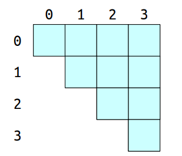

### Range Minimum Queries (2022.3.29)

---

RMQ studies such one question:

> Given an array A and two indices $i\leq j$, what is the smallest element out of $A[i],A[i+1],\cdots,A[j-1],A[j]$ ?

Denote a range minimum query in array A between $i$ and $j$ as `RMQ(i,j)`.

对于任意的一个RMQ类型的数据结构，我们给出一种在关于时间复杂度的规范化的定义 `<p(n),q(n)>`：

- preprocessing takes time at most `p(n)` and 
- queries take time at most `q(n)`.

**[Solution 1]**: 显然最简单的方式我们可以通过一个简单的$O(n)$时间的算法遍历区间所有元素维护一个最小值即可。

这里的Solution 1我们写为 `<O(1),O(n)>`. 

**[Solution 2]**: 考虑一种最简单的优化，我们先预处理出所有可能区间的最小值的结果。

首先最最朴素的方式我们来求解：首先$O(n^2)$的时间复杂度写出所有的区间，然后$O(n)$的时间复杂度求解每个区间的最小值，整体$O(n^3)$.

但是实际上我们可以使用动态规划的方式将这个时间复杂度降低到$O(n^2)$. 

考虑构建这样一个预处理的table:

首先计算对角线的元素的值，即区间长度为1的最小值。

每次从左到右，从下到上更新：`dp[i][j] = min(dp[i][j-1],dp[i+1][j])`. 

从而我们可以在$O(n^2)$的时间内预处理完所有区间的最小值。

这里的Solution 2给出了一个`<O(n^2),O(1)>`的RMQ数据结构。

到目前为止我们给出了两种解决方案：完全不带预处理的和全部预处理的结果，考虑这两种之间存在一些trade-off呢？

这里给出Solution 3

**[Solution 3]**: **Block Decomposition**

我们可以考虑将区间分块，每块的大小记为$b$. 假设array的总长度为$n$，我们将array分为$O(n/b)$个块。对于每个块我们可以预处理出每个块的最小值。

此时考虑给出一个区间$(i,j)$，我们需要求解这个区间的最小值：

- $O(1)$的时间找到块的下标 (divide by block size). 
- $O(b)$的时间用于扫描区间$(i,j)$之间的块的。
- $O(n/b)$找到区间$(i,j)$的最小值。
- 整体的时间为: $O(b+n/b)$. 

简单的均值不等式我们可以知道希望$b+n/b$最小的化，块的大小应该取为$b=\sqrt{n}$. 

从而Solution 3我们通过block decomposition得到了一个`<O(n),O(n^{1/2})>`的RMQ数据结构。

还能够做的更好吗？

**[Solution 4]** **Sparse Table** 

从直觉上考虑，`<O(n^2),O(1)>`的完全预处理的方案求解了所有可能区间的最小值，是否这里有部分结果是无用的呢？

考虑求解$(0,7)$之间的最小值，我们可以做的是找到$(0,3)$和$(4,7)$两个区间的最小值。

再极端一点：

我们可以发现：预处理太多，预处理花费的时间就太长了；预处理太少，有时候就没办法做到$O(1)$时间的查询。

现在我们的目标是是否能够预处理部分有用的区间最小值，使得预处理的这些区间足够满足所有的区间能够在$O(1)$的时间内进行查询。

一个方法是这样的：对于每个index $i$，我们计算从$i$开始size为$1,2,4,8,16,\cdots,2^k$的区间最小值直到达到array的长度。

- 这种方式下我们求到了从任意位置开始的大区间或者小区间的RMQ,
- 对于每个元素我们只需要求解$O(\log n)$的区间数量,
- 总的区间数量为$O(n\log n)$.

通过这种方式我们给出一个推论：

> Any range in the array can be formed as the union of two of these ranges.

任意一个区间都可以被两个区间覆盖。

考虑给出一个区间$(i,j)$的查询：

- 找到最大的$k$满足：$2^k \leq j-i+1$.
- 区间$(i,j)$可以被区间$(i,i+2^k-1)$和区间$(j-2^k+1,j)$覆盖。
- 每个已经预处理过的区间查询时间为$O(1)$.
- 整体的时间为$O(1)$.

下面给出预处理的过程：

第一列的元素$2^0$表示区间长度为1的最小值。

第二列的元素$2^1$取决于两个区间长度为1的最小值的最小值。

第三列的元素$2^2$取决于两个区间长度为2的最小值的最小值。

动态规划的转移方程为：$dp[i][2^k]=\min(dp[i][2^{k-1}],dp[i+2^{k-1}][2^{k-1}])$

考虑我们要求$dp[0][2^3]$，我们的转移方程为：$dp[0][2^3]=\min(dp[0][2^2],dp[2^2][2^2])$.

Solution 4给出了一种`<O(nlogn,O(1))>`的RMQ数据结构。

**[Solution 5]** **Hybrid Strategies**

回顾之前的分块方式，我们考虑在分块完之后，整个流程又变为了一个基于blocks的RMQ问题。

因此我们考虑在每个block构建RMQ，再在所有的block上再构建一个RMQ

整体的框架如下：

- Split the input into blocks of size $b$.
- Form an array of the block minima. 
- Construct a 'summary' RMQ structure over the block minima. 
- Construct 'block' RMQ structures for each block.
- Aggregate the results together.

大概意思如下图所示：

假设求解黄色区间的RMQ

问题变为：

分析有效性：

假设我们在summary RMQ使用了一个$\langle p_1(n),q_1(n)\rangle$的RMQ结构，同时在每个block中使用了一个$\langle p_2(n),q_2(n)\rangle$的RMQ结构，每个block尺寸为$b$. 

分析一下预处理的时间：

- $O(n)$ 用于计算每个block的最小值；
- $O(p_1(n/b))$ 用于构建summary RMQ的结构；
- $O((n/b)p_2(b))$ 用于构建每个block的RMQ的结构；

整体的预处理时间为：$O(n+p_1(n/b)+(n/b)p_2(b))$.

分析一下查询的时间：

- $O(q_i(n/b))$查询summary RMQ的结构；
- $O(q_2(b))$从查询block RMQ的结构；

整体的查询时间为：$O(q_1(n/b)+q_2(b))$.

下面考虑对于summary RMQ和block RMQ分别使用什么样的结构，

(1). 如果用最简单的不进行预处理的方法，直接查询，即solution 1的结构（`<O(1),O(n)>`）：

我们分别计算hybrid 1的预处理和查询时间：

- 预处理：$O(n+1+n/b)=O(n)$.
- 查询：$O(n/b+b)=O(n^{\frac{1}{2}})$. 

(2). 考虑summary RMQ使用 sparse table，block RMQ使用 solution 1. 

这里有一个trick，考虑将block大小设置为$\log n$.

则我们发现summary RMQ的时间复杂度为：

$O((n/b)\log(n/b))=O((n/\log n)\log(n/\log n))=O(n)$.

我们分别计算hybrid 1的预处理和查询时间：

- 预处理：$O(n+n+n/b)=O(n)$.
- 查询：$O(1+b)=O(1+\log n)=O(\log n)$.

这样我们就得到了一个新的RMQ结构：`<O(n),O(log n)>`.

(3). 如果我们在summary RMQ和block RMQ都使用sparse table呢？

分别计算预处理和查询时间：

- 预处理：$O(n+n+(n/\log n)\log n \log \log n)=O(n\log\log n)$.
- 查询：$O(1+1)=O(1)$.

这样我们又得到了一个新的RMQ结构：`<O(nloglog n,O(1))>`.

(4). 如果我们summary RMQ使用的是sparse table同时block RMQ使用的是`<O(n),O(log n)>`的结构。

分别计算预处理和查询时间：

- 预处理：$O(n+n+(n/b)b)=O(n)$.
- 查询：$O(1+\log b)=O(1+\log \log n)=O(\log\log n)$.

这又是一种新的RMQ结构：`<O(n),O(loglog n)>`.

| Type               | Time                                      |
| ------------------ | ----------------------------------------- |
| No preprocessing   | $\langle O(1),O(n) \rangle$               |
| Full preprocessing | $\langle O(n^2),O(1) \rangle$             |
| Block partition    | $\langle O(n),O(n^{\frac{1}{2}}) \rangle$ |
| Sparse Table       | $\langle O(n\log n),O(1) \rangle$         |
| Hybrid 1           | $\langle O(n),O(n^{\frac{1}{2}}) \rangle$ |
| Hybrid 2           | $\langle O(n),O(\log n) \rangle$          |
| Hybrid 3           | $\langle O(n\log\log n),O(1) \rangle$     |
| Hybrid 4           | $\langle O(n),O(\log\log n) \rangle$      |

---

### Range Minimum Queries (2022.4.1)

在上一个lecture中，最后给出的一系列的hybrid的方法，我们回顾思路，大概是先进行分块，然后每个块上进行RMQ，其中分为block的RMQ和聚合的RMQ.

从抽象的角度来看，这一类的hybrid strategies得到的结果有如下的预处理时间复杂度和查询时间复杂度：

- preprocessing time: $O(n+p_1(n/b)+(n/b)p_2(b))$. 怎样理解？首先$O(n)$处理分块，然后$O(p_1(n/b))$summary RMQ的预处理，$O((n/b)p_2(b))$进行每个block的预处理。
- query time: $O(q_1(n/b)+q_2(b))$. 怎样理解？在每个块中的查询需要$O(q_2(b))$同时在summary RMQ中的查询需要$O(q_1(n/b))$. 

那么下面一个问题是是否存在$\langle O(n),O(1) \rangle$的RMQ结构？

假设存在的话，这里的$p_2(b)$的时间复杂度应该为$O(b)$，同时$q_2(b)$的时间复杂度应该为$O(1)$. 

如何在每个块上构建一种$O(b)$时间预处理同时$O(1)$时间查询的方法？

> Solve RMQ on a large number of small arrays with $O(1)$ query time and total preprocessing time $O(n)$?

hint: $RMQ_A(i,j)$ denote the index with min val in the range i to j rather than the val itself.

如果RMQ结构返回的index而非values则我们使用单个RMQ结构就可以得到多个arrays的结果。

假设我们使用sparse table用于summary RMQ同时使用full-preprocessing的RMQ用于block，与之前的hybrid方法不同之处在于我们考虑在blocks之间共享这种RMQ结构，只有结构相同才能够共享。

这种方法在平均情况下可以得到一种$\langle O(n),O(1) \rangle$的RMQ数据结构. 

现在需要考虑两个重要的问题

- 我们如何判定两个block是结构相同的？
- 通过选择不同的$b$ value考虑存在多少种不同的block的type？

第一个思路是不太可行的。第二个我们考虑如何选择$b$的值的问题。

我们可以非常直接的给出两个block类型相同的定义：

- 假设存在两个blocks $B_1$和$B_2$，他们的长度都为$b$. 

- 我们认为两者type相同$(B_1\sim B_2)$如果下式成立：
  $$
  RMQ_{B_1}(i,j)=RMQ_{B_2}(i,j),\forall 0\leq i\leq j <b
  $$

刚刚是从定义上给出两者type相同的，考虑如何从code层面实现这个问题，最直接的方法是分别构建RMQ之后判定是否结果相同。但事实上不需要这样。

我们可以考虑每个block中的array的permutation type，假设升序表示为$(1,2,\cdots,n)$. 那么我们不难给出以下的推论：

**Lemma**: If $B_1$ and $B_2$ have the same permutation type, then $B_1\sim B_2$.

但是注意这里并不是充要条件，因为可能存在两者type相同但是permutation不同。

另一个很重要的问题是这里permutation的数量为$b!$. 这个$b$显然必须取的很小才可行。

继续观察：

**claim**: 如果$B_1\sim B_2$那么显然我们知道每个block的最小的值一定有相同的index.

**claim**: 上一个claim的性质一定是在左右的每个subarrays中都要成立的。

至此一个很重要的数据结构：**Cartesian Tree**

- 根节点为array中的最小值。
- left和right sub-tree都是一个Cartesian Tree分别对应着array的左右两边的sub-arrays.

**Definition:**

> The Cartesian tree for an array is a binary tree obeying the min-heap property whose inorder-traversal gives back the original array.

**Theorem**: Let $B_1$ and $B_2$ be blocks of length $b$, then $B_1\sim B_2$ iff $B_1$ and $B_2$ have isomorphic Cartesian trees. (same shape tree)

如何构建一个Cartesian Tree

最基本的方法：

- 找到最小值
- 对于array的最小值的左边的sub-array递归构建一个Cartesian Tree
- 对于array的最小值的右边的sub-array递归构建一个Cartesian Tree
- return the whole tree 

这个分治算法的时间复杂度：
$$
T(n)=T(n_{left})+T(n_{right}) + O(n)
$$
这个分治的过程太像快速排序了！

实际上算法的时间复杂度与快速排序是类似的，平均意义下，如果最小值在中间的话大概是$O(n\log n)$而如果最小值在边上则退化到$O(n^2)$. 

构建Cartesian Tree有没有更快的算法呢？

我们考虑这样：从第一个元素开始，依次往里面加元素同时调整树.

此时我们需要借助一个栈：

- 从栈中一直弹出元素直到栈顶元素大于当前的新的即将加入栈的元素或者栈为空
- 将新元素压入栈中
- 将最近从栈中弹出来的元素作为新元素的左孩子

这种方法构建Cartesian Tree的时间复杂度为$O(b)$, 其中$b$为array的长度。

现在我们就有了一种在$O(n)$时间复杂度内的构建Cartesian Tree的算法了。

**Theorem**: The number of distinct Cartesian tree shape for arrays of length $b$ is at most $4^b$.

(实际上的数字为$\frac{1}{b+1}\binom{2b}{b}=\frac{4^b}{b^{3/2}\sqrt{\pi}}$). 详情了解**Catalan Number**

本质上最多有$2b$次stack的操作，$b$次push以及$b$次pop操作。

这样对于每一个block我们可以得到一个对应的Cartesian Number，在实际操作中我们并不需要真正的构建这个Tree，而是通过比对Cartesian Number来判别两个block是否type相同。

回到开始提出的问题：

- 我们如何判定两个block是结构相同的？
- 通过选择不同的$b$ value考虑存在多少种不同的block的type？

**[Answer]**:

- 当两个block的Cartesian Tree Number相同时我们认为结构相同。
- 至多$4^b$种不同的type.

由此我们可以给出如下的结构：

下面分析其时间复杂度：Preprocessing: $O(n+(n/b)\log (n/b)+b^24^b)$.

其中：

- $O(n)$ 计算block minima，计算每个block的Cartesian Tree Number.
- $O((n/b)\log(n/b))$表示为build a sparse table on blocks of size $n/b$.
- $O(b^2 4^b)$表示为construct至多$4^b$个block RMQ结构，每一个的时间复杂度为$O(b^2)$.

这里我们选择$b=k\log_4 n$.
$$
\begin{split}
&O(n+(n/k\log_4 n)\log(n/k\log_4 n)+k^2(\log_4 n)^2+n^k)\\
=& O(n+(n/\log n)\log n) + (\log n)^2 n^k\\
=&O(n)
\end{split}
$$
这里考虑取一个$k=\frac{1}{2}$, 整体的preprocessing的时间为$O(n)$.

这种RMQ的结构被称为Fischer-Heun Structure. 这是一种改进的hybrid RMQ framework. 

- set $b=\frac{1}{2}\log_4 n =\frac{1}{4}\log_2 n$.
- 将input的array分为size为$b$的blocks，计算每个block的最小值。
- 给这些最小值的新array构建一个sparse table. 
- 构建一个per-block RMQ结构，计算每个block的Cartesian Tree Number. 
- 将相同结构的block映射到一起。

这样我们就得到了一个$\lang O(n),O(1) \rang$的RMQ结构。

**Further**:

这种构建模型的思路是"Methods of Four Russians"或者说"Four Russians Speedup". 

- 按照block拆分问题。(**macro/micro decomposition**)
- 处理所有的block下的子问题。
- 通过合并所有block的问题的解得到最终的解。

**"Divide Precompute Conquer"**.

关于为什么叫四个俄罗斯人算法，因为这个方法来自于一篇文章，其作者是四个俄罗斯人。

一些相关的内容：

- Lowest Common Ancestors
- Succinct RMQ 
- Durocher's RMQ Structure

