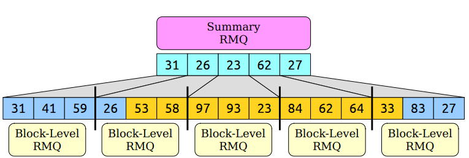

### Range Minimum Queries 

---

RMQ studies such one question:

> Given an array A and two indices $i\leq j$, what is the smallest element out of $A[i],A[i+1],\cdots,A[j-1],A[j]$ ?

Denote a range minimum query in array A between $i$ and $j$ as `RMQ(i,j)`.

对于任意的一个RMQ类型的数据结构，我们给出一种在关于时间复杂度的规范化的定义 `<p(n),q(n)>`：

- preprocessing takes time at most `p(n)` and 
- queries take time at most `q(n)`.

**[Solution 1]**: 显然最简单的方式我们可以通过一个简单的$O(n)$时间的算法遍历区间所有元素维护一个最小值即可。

这里的Solution 1我们写为 `<O(1),O(n)>`. 

**[Solution 2]**: 考虑一种最简单的优化，我们先预处理出所有可能区间的最小值的结果。

首先最最朴素的方式我们来求解：首先$O(n^2)$的时间复杂度写出所有的区间，然后$O(n)$的时间复杂度求解每个区间的最小值，整体$O(n^3)$.

但是实际上我们可以使用动态规划的方式将这个时间复杂度降低到$O(n^2)$. 

考虑构建这样一个预处理的table:

首先计算对角线的元素的值，即区间长度为1的最小值。

每次从左到右，从下到上更新：`dp[i][j] = min(dp[i][j-1],dp[i+1][j])`. 

从而我们可以在$O(n^2)$的时间内预处理完所有区间的最小值。

这里的Solution 2给出了一个`<O(n^2),O(1)>`的RMQ数据结构。

到目前为止我们给出了两种解决方案：完全不带预处理的和全部预处理的结果，考虑这两种之间存在一些trade-off呢？

这里给出Solution 3

**[Solution 3]**: **Block Decomposition**

我们可以考虑将区间分块，每块的大小记为$b$. 假设array的总长度为$n$，我们将array分为$O(n/b)$个块。对于每个块我们可以预处理出每个块的最小值。

此时考虑给出一个区间$(i,j)$，我们需要求解这个区间的最小值：

- $O(1)$的时间找到块的下标 (divide by block size). 
- $O(b)$的时间用于扫描区间$(i,j)$之间的块的。
- $O(n/b)$找到区间$(i,j)$的最小值。
- 整体的时间为: $O(b+n/b)$. 

简单的均值不等式我们可以知道希望$b+n/b$最小的化，块的大小应该取为$b=\sqrt{n}$. 

从而Solution 3我们通过block decomposition得到了一个`<O(n),O(n^{1/2})>`的RMQ数据结构。

还能够做的更好吗？

**[Solution 4]** **Sparse Table** 

从直觉上考虑，`<O(n^2),O(1)>`的完全预处理的方案求解了所有可能区间的最小值，是否这里有部分结果是无用的呢？

考虑求解$(0,7)$之间的最小值，我们可以做的是找到$(0,3)$和$(4,7)$两个区间的最小值。

再极端一点：

我们可以发现：预处理太多，预处理花费的时间就太长了；预处理太少，有时候就没办法做到$O(1)$时间的查询。

现在我们的目标是是否能够预处理部分有用的区间最小值，使得预处理的这些区间足够满足所有的区间能够在$O(1)$的时间内进行查询。

一个方法是这样的：对于每个index $i$，我们计算从$i$开始size为$1,2,4,8,16,\cdots,2^k$的区间最小值直到达到array的长度。

- 这种方式下我们求到了从任意位置开始的大区间或者小区间的RMQ,
- 对于每个元素我们只需要求解$O(\log n)$的区间数量,
- 总的区间数量为$O(n\log n)$.

通过这种方式我们给出一个推论：

> Any range in the array can be formed as the union of two of these ranges.

任意一个区间都可以被两个区间覆盖。

考虑给出一个区间$(i,j)$的查询：

- 找到最大的$k$满足：$2^k \leq j-i+1$.
- 区间$(i,j)$可以被区间$(i,i+2^k-1)$和区间$(j-2^k+1,j)$覆盖。
- 每个已经预处理过的区间查询时间为$O(1)$.
- 整体的时间为$O(1)$.

下面给出预处理的过程：

第一列的元素$2^0$表示区间长度为1的最小值。

第二列的元素$2^1$取决于两个区间长度为1的最小值的最小值。

第三列的元素$2^2$取决于两个区间长度为2的最小值的最小值。

动态规划的转移方程为：$dp[i][2^k]=\min(dp[i][2^{k-1}],dp[i+2^{k-1}][2^{k-1}])$

考虑我们要求$dp[0][2^3]$，我们的转移方程为：$dp[0][2^3]=\min(dp[0][2^2],dp[2^2][2^2])$.

Solution 4给出了一种`<O(nlogn,O(1))>`的RMQ数据结构。

**[Solution 5]** **Hybrid Strategies**

回顾之前的分块方式，我们考虑在分块完之后，整个流程又变为了一个基于blocks的RMQ问题。

因此我们考虑在每个block构建RMQ，再在所有的block上再构建一个RMQ

整体的框架如下：

- Split the input into blocks of size $b$.
- Form an array of the block minima. 
- Construct a 'summary' RMQ structure over the block minima. 
- Construct 'block' RMQ structures for each block.
- Aggregate the results together.

大概意思如下图所示：

假设求解黄色区间的RMQ

问题变为：

分析有效性：

假设我们在summary RMQ使用了一个$\langle p_1(n),q_1(n)\rangle$的RMQ结构，同时在每个block中使用了一个$\langle p_2(n),q_2(n)\rangle$的RMQ结构，每个block尺寸为$b$. 

分析一下预处理的时间：

- $O(n)$ 用于计算每个block的最小值；
- $O(p_1(n/b))$ 用于构建summary RMQ的结构；
- $O((n/b)p_2(b))$ 用于构建每个block的RMQ的结构；

整体的预处理时间为：$O(n+p_1(n/b)+(n/b)p_2(b))$.

分析一下查询的时间：

- $O(q_i(n/b))$查询summary RMQ的结构；
- $O(q_2(b))$从查询block RMQ的结构；

整体的查询时间为：$O(q_1(n/b)+q_2(b))$.

下面考虑对于summary RMQ和block RMQ分别使用什么样的结构，

(1). 如果用最简单的不进行预处理的方法，直接查询，即solution 1的结构（`<O(1),O(n)>`）：

我们分别计算hybrid 1的预处理和查询时间：

- 预处理：$O(n+1+n/b)=O(n)$.
- 查询：$O(n/b+b)=O(n^{\frac{1}{2}})$. 

(2). 考虑summary RMQ使用 sparse table，block RMQ使用 solution 1. 

这里有一个trick，考虑将block大小设置为$\log n$.

则我们发现summary RMQ的时间复杂度为：

$O((n/b)\log(n/b))=O((n/\log n)\log(n/\log n))=O(n)$.

我们分别计算hybrid 1的预处理和查询时间：

- 预处理：$O(n+n+n/b)=O(n)$.
- 查询：$O(1+b)=O(1+\log n)=O(\log n)$.

这样我们就得到了一个新的RMQ结构：`<O(n),O(log n)>`.

(3). 如果我们在summary RMQ和block RMQ都使用sparse table呢？

分别计算预处理和查询时间：

- 预处理：$O(n+n+(n/\log n)\log n \log \log n)=O(n\log\log n)$.
- 查询：$O(1+1)=O(1)$.

这样我们又得到了一个新的RMQ结构：`<O(nloglog n,O(1))>`.

(4). 如果我们summary RMQ使用的是sparse table同时block RMQ使用的是`<O(n),O(log n)>`的结构。

分别计算预处理和查询时间：

- 预处理：$O(n+n+(n/b)b)=O(n)$.
- 查询：$O(1+\log b)=O(1+\log \log n)=O(\log\log n)$.

这又是一种新的RMQ结构：`<O(n),O(loglog n)>`.

| Type               | Time                                      |
| ------------------ | ----------------------------------------- |
| No preprocessing   | $\langle O(1),O(n) \rangle$               |
| Full preprocessing | $\langle O(n^2),O(1) \rangle$             |
| Block partition    | $\langle O(n),O(n^{\frac{1}{2}}) \rangle$ |
| Sparse Table       | $\langle O(n\log n),O(1) \rangle$         |
| Hybrid 1           | $\langle O(n),O(n^{\frac{1}{2}}) \rangle$ |
| Hybrid 2           | $\langle O(n),O(\log n) \rangle$          |
| Hybrid 3           | $\langle O(n\log\log n),O(1) \rangle$     |
| Hybrid 4           | $\langle O(n),O(\log\log n) \rangle$      |

---

