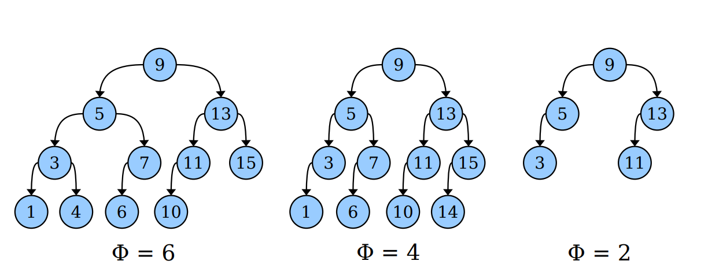

### Scapegoat Trees 

---

#### Amortized Analysis 

last lecture是关于均摊时间的分析，我们引入了势函数potential function：

- $\Phi$ measures how "messy" the data structure is;
- $\Phi_{start}=0$;
- $\Phi\geq 0$.

我们定义一个操作的均摊时间为：amortized-cost = real-cost + $k\cdot \Delta \Phi$.

直觉上：

- 如果一个操作的使得系统变得更混乱了同时需要后续再进行整理，这个均摊的时间代价会比初始的时间代价更高。
- 如果一个操作使得系统变得clean，则均摊的时间代价会比真实的cost更小。

这里的目标是给出一个维护树平衡的更加容易的方式，我们考虑的是均摊的时间成本而非最坏情况下的时间成本。

考虑对于一个完美的平衡二叉树，假设共计有$n > 0$个节点，我们知道这个树的高度为$\log n$. 

但是往往维护这个树的shape是比较困难的，因为一个简单的插入或者删除操作往往会需要多次的reshuffling.

为了更快的添加元素和删除元素，大多数平衡二叉树确保树的高度为$\log n$的倍数。

对于红黑树而言，其高度在最坏情况下是$2\log n$. 

假设我们考虑我们的trees的高度可以是$\alpha \log n$ for some $\alpha > 1$. 

那么我们是否设计一个仅仅基于这个设定的平衡的二叉树而不依赖于其他的结构上的约束？

**Adding Slack Space**

- Pick a fixed constant $\alpha > 1$. 
- Set the maximum height on our tree to $\alpha \log n$. 
- As long as we don not exceed this maximum height, all operations on our BST will run in time $O(\log n)$, and we do not really care about the shape of the tree. 

对于每个节点$v$, 我们定义size(v)表示为以$v$为根节点的子树的节点的个数，height(v)表示的该子树的高度。

我们认为一个节点$v$是$\alpha-balanced$如果满足height(v) $\leq \alpha \log $ size(v). 

 假设插入的时候有一个节点超过了tree的极限高度，我们考虑需要对树进行一些调整：

**Scapegoat Nodes**:

- 我们考虑从root节点到最新插入节点之间的路径

- 我们知道root节点肯定不是$\alpha-$balanced，因为整个树的高度太高了。
- 我们又知道这个新插入的点是$\alpha-$balanced, 因为其没有children.
- 因此一定有一个节点在这个路径上不满足$\alpha-$balanced.
- 我们找到这个节点同时称其为scapegoat节点。

重新构建以这个scapegoat节点的子树成一个perfectly-balanced BST. 

这个能够reduce子树的高度，从而最后使得整个tree达到极限高度的要求。

下面给出Scapegoat Tree的具体构建方法：

- 给出一个常数$\alpha > 1$. 
- 只要树的高度小于$\alpha \log n$, 插入之后不需要进行重新平衡的操作；
- 一旦这个tree高度超出了限制，我们找到scapegoat节点；
- 重新构建以这个scapegoat节点为根节点的子树；

我们需要考虑以下的一些问题：

- 我们如何证明调整了scapegoat节点的子树之后可以成功修正树的高度？
- 我们重新构建这个子树的时间复杂度为多少？
- 我们如何找到这个scapegoat节点？
- 从均摊复杂度的角度分析时间？

**Theorem**: Optimally rebuilding the subtree rooted at the scapegoat node ensures that, as a whole, the tree has height at most $\alpha \log n$. 

**Proof**: 假设我们在插入当前节点时违背了高度限制，则在插入该节点前这个tree的高度应该小于等于$\alpha \log n$. 这也就意味着除了当前节点高度为$\lfloor \alpha \log n\rfloor+ 1$外，其他节点的高度在$\lfloor \alpha \log n\rfloor$以内。

现在我们考虑scapegoat节点，由于仅仅存在一层的超过，我们只需要证明重构后的子树比原子树至少高度下降了1. 

假设$v$表示scapegoat node，由于不平衡我们知道：
$$
height_{before}(v) > \alpha \log size(v)
$$
我们令$r$表示为这个子树重构之后的root，由于我们重新构建这个子树，我们可以得到：
$$
\log size(v) \geq height_{after}(r)
$$
从而进一步：
$$
height_{before}(v) > \alpha \log size(v)\geq height_{after}(r)
$$
也就是说：
$$
height_{before}(v) > height_{after}(r)
$$
因此重构后的子树高度一定至少下降了1. 

**The cost of rebuilding**

我们重构的方式为：

- 首先考虑中序遍历得到这个子树的有序的结果；
- 使用下面的递归方法构建新tree；
  -  如果不存在剩余的节点，我们直接返回一个空树；
  - 否则我们将中间元素放在这个tree的根部，同时递归构建左右子树；

这样构建的时间成本为$O(size(v))$其中$v$表示的是这个子树的root.

（对于这个构建问题，还存在一些更好的方法：Galperin-Rivest / Day-Stout-Warren算法）

**Finding the scapegoat node**

我们能够以什么样的效率找到这个scapegoat节点呢？

对于每个在从root到新插入节点的路上的节点$v$, $height(v)$表示为在$v$和新添加的节点之间的steps. 

如何计算$size(v)$呢，我们可以有两种做法。

1. 我们可以在边插入节点或者删除节点的时候对于每个节点维护一个cost. 需要额外的空间。
2. 我们也可以自底向上计算这个size. 从新插入的节点开始记为1，我们在反向tree上使用dfs直到搜索到scapegoat节点，返回这个size的值，整个过程需要$O(size(v))$的时间复杂度。

**Analyzing Efficiency**

- 基于我们已经看到的东西，对于一次插入而言，我们可以计算时间复杂度为：
  - 如果这个插入可以使树的高度保持不超过极限高度，那么时间为$O(\log n)$.
  - 如果我们需要调整子树，这个时间为$O(\log n + size(v))$. 
- 极端情况下，我们会发现这个调整tree的时间可以达到$O(n)$，即整个树都要重建。
- 但是我们可以考虑均摊时间复杂度上进行分析，因为上述的情况发生的次数不会很多。

我们的目标现在就是找一个合适的势函数$\Phi$:

- perfectly-balanced trees have low $\Phi$;
- $\alpha-$imbalanced tree have high $\Phi$;

这里定义的不平衡性表示为一个节点左右子树上节点的个数的差值，如果为0表示完美平衡，差值的数量表示不平衡的程度。
$$
(v) = \vert size(v.left) - size(v.right)\vert
$$
直觉上我们可以定义$\Phi=\sum_{v}(v)$因为对于越平衡的树，节点的“不平衡性”就越弱，这个势函数就越小。但是这个并不完全合理，如下图所示：

首先看前两个，两个都是完全二叉树，但是势函数的值不太一样，这就意味着当我们想要重新平衡树的时候，我们需要确保使每个节点的左、右子树中的节点数量相等。

对于一个完美平衡二叉树而言，其势函数的是一个关于其节点数量的函数。考虑第二个和第三个tree，我们发现两个都是完美平衡二叉树，因此两个tree的势函数都应该为0，但是这里一个为2一个为4. 

考虑到这个我们重新定义$'(v)$:
$$
'(v) =
\begin{cases}
0 & (v)\leq 1\\
(v) & \text{otherwise}
\end{cases}
$$
