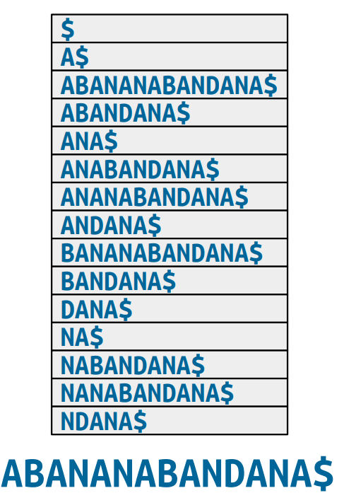
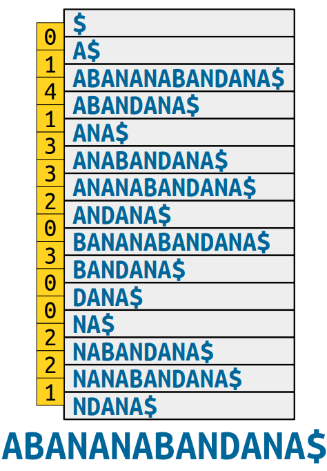

### Suffix and LCP Arrays

---

回顾字符串后缀树:

**Theorem**: $w$ is a substring of $x$ iff $w$ is a prefix of a suffix of $x$.

对于一个后缀树，其中包含$O(m)$个节点和$O(m)$条边，其中$m$表示的是该输入字符串中的字符的数量。

对于长度为$m$的字符串而言，写出所有的后缀字符串需要$\Theta(m^2)$的字符。

对于这种表征，我们是可以使用$O(m)$的空间来存储这个后缀树的。

考虑后缀树的每一条边上都标记了一个子字符串。事实上我们是不需要真的将所有的标记写出来的，我们只需要记录其起点和终点的index即可。

对于一棵后缀树：                         

- $O(m)$的空间存储所有的节点；
- $O(m)$的空间复制原字符串；
- $O(m)$的空间存储所有的边；

**Theorem**: There is a node labeled $w$ in a suffix tree for $T$ **iff** $w$ is a suffix of $T\$$ or $w$ is a branching word in $T\$$. 

怎么理解这个定理，首先$w$是一个suffix很好理解，对于每个后缀都会存一个节点，而另外的一些节点我们称之为branching words. 分支单词的定义是说：如果存在不同的字符$a,b$使得$wa$和$wb$都是$T\$$的子字符串，那么这个$w$就被称为一个分支单词。

A string $w$ is a branching word in $T\$$ if there are distinct characters $a$ and $b$ where $wa$ and $wb$ are substrings of $T\$$. 

The efficiency in a suffix tree is largely due to:

- Keeping the suffixes in sorted order;
- exposing branching words.

下面引入两个重要的数据结构，suffix array和LCP array. 

suffix array: 存储关于一个字符串的后缀的顺序信息。

LCP array: 存储关于一个字符串的分支单词的信息。

##### Suffix Arrays

对于一个string $T$来说一个suffix arrays是一个有序的array，其中存储了所有的关于$T$的后缀。后缀数组只提炼出后缀树的第一个组成部分：它们以排序的方式存储后缀。构建suffix arrays的时间复杂度为$O(m)$. 

对于Suffix Arrays我们按照字母序排序，同时我们只记录每个字母在原字符串中出现的起始位置。

我们可以使用二分查找的方法，对于中间位置，遍历该位置的后缀与模式串，检测模式串是否是其前缀，如果满足则认为当前找到的是满足条件的位置，同时根据下一个位置的字母决定指针的移动方向。

这样在$O(n\log m)$的时间复杂度内我们可以解决这样的一个匹配问题。

准确一点是$O(n\log m + z)$其中$z$是匹配的次数。

仿照之前的写法，我们通过有序的后缀数组得到一种$\langle O(m), O(n\log m+z) \rangle$的算法来解决子字符串的搜索问题。

##### Branching Words

我们注意到，当我们将所有的后缀按字母序进行排序后，我们得到的后缀数组：

我们不难发现，所有的branching words都是连在一起的，比如说这里的$ABAN$, $BAN$等等。branching word就是那些相邻的后缀的最长公共前缀(LCP).

**Key Intuition**: 带有长的共享的前缀的邻接的那些后缀对应于整个后缀树的子树。

##### Longest Repeated Substring

最朴素的做法：我们可以通过$O(m^2)$的时间复杂度来从一个suffix array中列出所有的branching words.

为了加速这个过程，我们下面引出LCP Arrays

##### LCP Arrays

我们定义为$H$, 其中$H[i]$表示为第$i$个和第$i+1$个后缀的LCP的长度。

直觉上来说，这个后缀数组给了这个后缀树的leaves，LCP数组给了这个后缀树的internal nodes. 

假设我们已经有了Suffix Arrays和LCP Arrays, 我们应该如何在$O(m)$的时间内解决最长重复子串的问题。

- 找到LCP Array中的最大元素；
- 返回其对应的string；

如何构建这个LCP Array呢？

最朴素的做法我们可以使用$O(m^2)$的算法完成这个事情。

由于后缀是一个覆盖另一个的，我们可以在后缀之间共享LCP的信息。

先给出一个LCP数组的结果：

枚举按字典序排序好的所有的后缀，计算相邻的两个后缀之间的最长公共前缀的长度就是LCP数组对应位置的值。

考虑简单的例子，这里的第三个和第四个后缀的LCP的长度为4，如果我们将两个后缀的第一个字母去掉我们就可以得到第九个和第十个的后缀的LCP的长度为3.

然而我们需要注意一种情况，当我们去掉两个相邻后缀的第一个字母的时候，这两个新的后缀的位置可能不再是相互邻接的。但是在这两个不相互邻接的后缀之间的那些后缀我们有这样一个结论：

**Claim:**减去第一个字母后的两个后缀之间的LCP至少是原来的两个后缀的LCP减去1.

考虑一棵后缀树，我们知道假设两个更短的后缀在同一棵子树上，则他们之间的所有的其他后缀都是在这个子树上的。

然而我们需要考虑一件事情，这个新的LCP的长度可能是超过原来的LCP-1的，因为我们之前从来没有见过这两个后缀。我们仍然需要一些额外的重新扫描。

这里引出一个新的算法Kasai's Algorithm 

- For each suffix of the original string, except the last:
  - Find that suffix in the suffix array. 
  - Look at the suffix that comes before it. 
  - Find the length of the longest common prefix of those suffixs.
  - Write that down in the H array.
- Use the insight from the previous slides to speed up step.

算法的基本的思想可以考虑如下：

- 找到原字符串在suffix array中的位置，然后计算这个suffix和前一个suffix的LCP并填入LCP array中。
- 将这个原字符串的第一个字母去掉，二分找到位置后，计算这个新的suffix和他的前一个suffix的LCP并且填入LCP array中。
- 不断重复这个过程直到整个LCP array填完整。

这个算法的整体运行时间为$O(m)$. 

##### More to Explore 

一些没有覆盖的知识点：

- **Bottom-up tree simulations**: Using LCP arrays, we can simulate any $O(m)$-time suffix tree algorithm that works with a bottom-up DFS in time $O(m)$.
- **Faster substring searching**: Using LCP arrays, plus RMQ, we can improve the cost of a substring search to $O(n+z+\log m)$.
- **Burrows-Wheeler transforms**: Suffix arrays, plus LCP arrays can be used to significantly improve the performance of text compressors. 

##### Next Time

Building Suffix Trees 

Building Suffix Arrays
